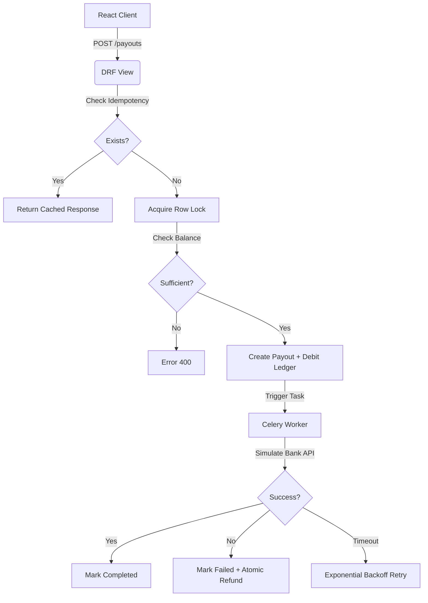

# 🚀 Playto Payout Engine

A production-grade, high-integrity payout system built with **Django**, **React**, and **Celery**. This engine is designed to handle real money movements with strict data integrity, zero race conditions, and robust idempotency.

---

## 💎 Project Philosophy
Handling money requires more than just "adding and subtracting." This engine is built on three pillars:
1.  **Correctness over Simplicity**: Using a transaction-based ledger instead of a stored balance.
2.  **Concurrency First**: Preventing overdraws using database-level row locks.
3.  **Distributed Reliability**: Ensuring that network failures don't lead to duplicate payouts via idempotency.

---

## 🛠 Tech Stack
- **Backend**: Django 5.0 + Django REST Framework
- **Database**: PostgreSQL (Architected for row-level locking)
- **Background Jobs**: Celery + Redis (Exponential backoff & retries)
- **Frontend**: React 18 + Tailwind CSS + Lucide Icons
- **Design**: Modern Dark Mode UI with Glassmorphism effects

---

## 🌟 Key Features

### 1. Transaction-Based Ledger
- **No Stored Balance**: Balance is calculated via DB aggregation (`Sum(Credits) - Sum(Debits)`).
- **Precision**: Money is stored in **Paise** (BigIntegerField) to avoid floating-point errors.
- **Audit Trail**: Every movement is recorded; no record is ever deleted.

### 2. Concurrency Control (Race Condition Prevention)
- Uses `select_for_update()` on the Merchant record.
- If two payout requests of ₹60 arrive for a ₹100 balance, the database serializes them.
- **Result**: Only the first one succeeds; the second one is rejected with an "Insufficient Balance" error.

### 3. Strict Idempotency
- **Header-based**: Requires `Idempotency-Key` (UUID) for all payout requests.
- **Status Tracking**: Returns the exact same response for duplicate requests within 24 hours.
- **Conflict Handling**: Returns `409 Conflict` if a second request arrives while the first is still processing.

### 4. Payout State Machine
- **Transitions**: `PENDING` ➔ `PROCESSING` ➔ `COMPLETED` / `FAILED`.
- **Atomic Refunds**: If a payout fails in the background worker, the funds are automatically credited back to the ledger in a single atomic transaction.

---

## 🚀 Getting Started

### 1. Prerequisites
- Python 3.10+
- Node.js 18+
- Redis (for Celery)

### 2. Backend Setup
```bash
cd backend
# Install dependencies
pip install -r requirements.txt

# Run migrations
python manage.py migrate

# Create a test merchant (prints ID to terminal)
python manage.py shell -c "from merchants.models import Merchant; m, _ = Merchant.objects.get_or_create(name='Demo Merchant', email='demo@playto.com'); print(f'MERCHANT_ID: {m.id}')"

# Start the server
python manage.py runserver
```

### 3. Celery Setup (In a new terminal)
```bash
cd backend
celery -A core worker -l info
```

### 4. Frontend Setup
```bash
cd frontend
npm install
npm run dev
```

---

## 📂 Architecture Overview



---

## 🧪 Testing the Engine
The project includes a robust test suite for verifying high-concurrency scenarios:
```bash
cd backend
python manage.py test payouts.tests
```

---

## 📝 License
Built with ❤️ for Playto Payout Engine. Correctness is not optional.
